<div align="center">




<p>
  <a href="https://zer0dev.es" target="_blank"></a>
  <a href="https://discord.com/users/817515739711406140" target="_blank"></a>
  <a href="mailto:zeropersonalmail@gmail.com"></a>
  <a href="https://twitter.com/zer0_9999" target="_blank"></a>
</p>

</div>

### 👨‍💻 Sobre mí

```python
class Zer0Dev:
    location   = "País Vasco | Basque Country"
    focus      = ["Inteligencia Artificial", "Big Data"]
    building   = ["Arquitecturas escalables", "Pipelines de datos", "Microservicios"]
    stack      = {
        "backend":  ["Python (FastAPI, Flask)", "Node.js", "Java"],
        "frontend": ["TypeScript", "Next.js", "React", "Astro"],
        "data":     ["PostgreSQL", "MongoDB", "Redis", "SQLite"],
    }
    infra      = ["Linux", "Docker", "Buenas prácticas de despliegue"]
    learning   = ["IA", "Ciberseguridad", "something every day"]
```

### 🛠️ Tech Stack & Herramientas

<table>
  <tr>
    <td align="center" width="170"><b>🧠 Big Data,<br>Pipelines & Backend</b></td>
    <td>
      
      
      
      
      
      
      
      
      
    </td>
  </tr>
  <tr>
    <td align="center"><b>🎨 Frontend</b></td>
    <td>
      
      
      
      
      
    </td>
  </tr>
  <tr>
    <td align="center"><b>🗄️ Databases<br>& Storage</b></td>
    <td>
      
      
      
      
    </td>
  </tr>
  <tr>
    <td align="center"><b>⚙️ Infraestructura<br>& DevOps</b></td>
    <td>
      
      
      
    </td>
  </tr>
</table>

<div align="center">
  <sub>⚡ Learning something every day · <a href="https://zer0dev.es">zer0dev.es</a></sub>
</div>
