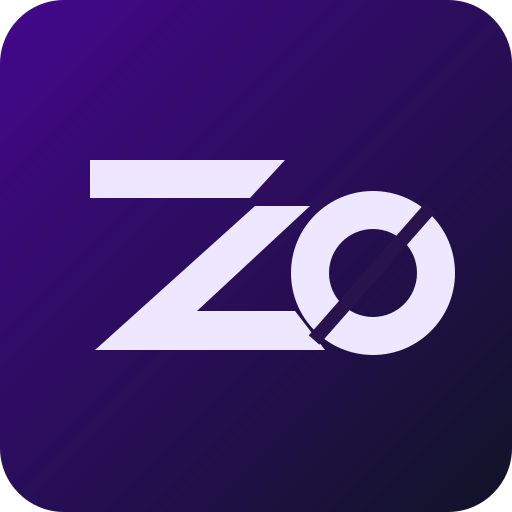

# Zer0Dev

**Software Developer · AI & Big Data**

Building useful software, developer tools and data-driven solutions.

Based in the Basque Country, Spain.

[Website](https://zer0dev.es) · [Discord](https://discord.com/users/817515739711406140) · [Email](mailto:zeropersonalmail@gmail.com) · [X](https://twitter.com/zer0_9999)

---

### About me

I build practical projects across **backend development, automation, AI and data engineering**. I like experimenting with new technologies and turning ideas into working software.

**Tools I work with**

`Python` · `TypeScript` · `JavaScript` · `FastAPI` · `Node.js` · `React` · `Astro` · `MongoDB` · `PostgreSQL` · `Docker` · `Linux`

### Featured projects

| Project | Description |
| :-- | :-- |
| [**MugiManager**](https://github.com/Zer0Dev-exe/MugiManager) | Independent public transport planner for Gipuzkoa and Bizkaia. |
| [**Zer0Code**](https://github.com/Zer0Dev-exe/Zer0Code) | AI coding agent orchestration for desktop, web and mobile. |
| [**AnomaNet**](https://github.com/Zer0Dev-exe/AnomaNet) | Machine-learning network anomaly detection with Wazuh alerts. |
| [**Mangosta**](https://github.com/Zer0Dev-exe/Mangosta) | CLI for managing MongoDB Cloud. |
| [**dualhook**](https://github.com/Zer0Dev-exe/dualhook) | Discord webhook editor with previews and Components V2. |
| [**Zer0Dev.es**](https://github.com/Zer0Dev-exe/Zer0Dev.es) | Source code of my personal website. |

### All repositories

Browse my projects

<!-- REPOS:START -->
| Proyecto | Descripción | Lenguaje | Creado |
|---|---|---|---|
| [Kanto3D](https://github.com/Zer0Dev-exe/Kanto3D) |  | Rust | 20/10/2026 |
| [MugiManager](https://github.com/Zer0Dev-exe/MugiManager) | Planificador de viajes en tren, metro y autobús por Gipuzkoa y Bizkaia. Web, PWA y app Android. Proyecto independiente, no oficial. | Python | 16/10/2026 |
| [Zer0Dev.es](https://github.com/Zer0Dev-exe/Zer0Dev.es) | The code of my personal website | Astro | 15/10/2026 |
| [dualhook](https://github.com/Zer0Dev-exe/dualhook) | Editor de webhooks de Discord con V1 (embeds) y V2 (Components V2) bien separados, vista previa y backups | TypeScript | 13/10/2026 |
| [Modmail](https://github.com/Zer0Dev-exe/Modmail) | Sistema de Modmail para Discord común con funcionalidades y paquetes actualizados | JavaScript | 08/10/2026 |
| [CTF-Coach](https://github.com/Zer0Dev-exe/CTF-Coach) | Versión corta de lo que sería un THM o HTB con un pequeño ML | Python | 07/10/2026 |
| [ZETAK-Redesign](https://github.com/Zer0Dev-exe/ZETAK-Redesign) | ZETAK - Redesign ( Educational Project ) | CSS | 04/10/2026 |
| [AnomaNet](https://github.com/Zer0Dev-exe/AnomaNet) | IDS basado en Machine Learning que detecta anomalías en tráfico de red y envía alertas explicables a Wazuh | Python | 02/10/2026 |
| [UNI-Moodle-Drive-Sync](https://github.com/Zer0Dev-exe/UNI-Moodle-Drive-Sync) | Un scrapper del Moodle de UNI Eibar Ermua | Python | 01/10/2026 |
| [Mangosta](https://github.com/Zer0Dev-exe/Mangosta) | CLI para gestionar todo lo que puedes gestionar desde MongoDB Cloud | Python | 01/10/2026 |
| [EnvVault](https://github.com/Zer0Dev-exe/EnvVault) | Almacenador, Importador y Exportador de .env-s | Python | 25/09/2026 |
| [GitKeeper](https://github.com/Zer0Dev-exe/GitKeeper) | Proyecto para manejar tus repositorios de Git más rápidamente y más eficaz | Python | 25/09/2026 |
| [GitMaster](https://github.com/Zer0Dev-exe/GitMaster) | Un CLI / aplicación para controlar mejor tus servicios/procesos y con sincronización a PM2 | TypeScript | 22/09/2026 |
| [Zer0Code](https://github.com/Zer0Dev-exe/Zer0Code) | Orquestador de agentes de IA con Claude Code, Codex y Gemini CLI. Desarrolla y revisa código desde escritorio, web y móvil, en tu propio equipo o servidor. | JavaScript | 22/09/2026 |
| [J.A.R.V.I.S](https://github.com/Zer0Dev-exe/J.A.R.V.I.S) | Próximo bot de seguridad, posible funcionalidad independiente de agente | TypeScript | 21/09/2026 |
| [Red-BotDiscord](https://github.com/Zer0Dev-exe/Red-BotDiscord) | Copia del RedBot pero versión mucho más rápida de instalar sin tantos idiomas | Python | 21/09/2026 |
| [VortexClone](https://github.com/Zer0Dev-exe/VortexClone) | Versión restructurada de Vortex con Dash y MongoDB | TypeScript | 18/09/2026 |
| [Reto-GOOGA2](https://github.com/Zer0Dev-exe/Reto-GOOGA2) | Reto de Dietetica | C# | 02/02/2026 |
| [zer0dev-exe.github.io](https://github.com/Zer0Dev-exe/zer0dev-exe.github.io) | Para el perfil de github | CSS | 31/01/2023 |
<!-- REPOS:END -->

Always learning, always building · <a href="https://zer0dev.es">zer0dev.es</a>

